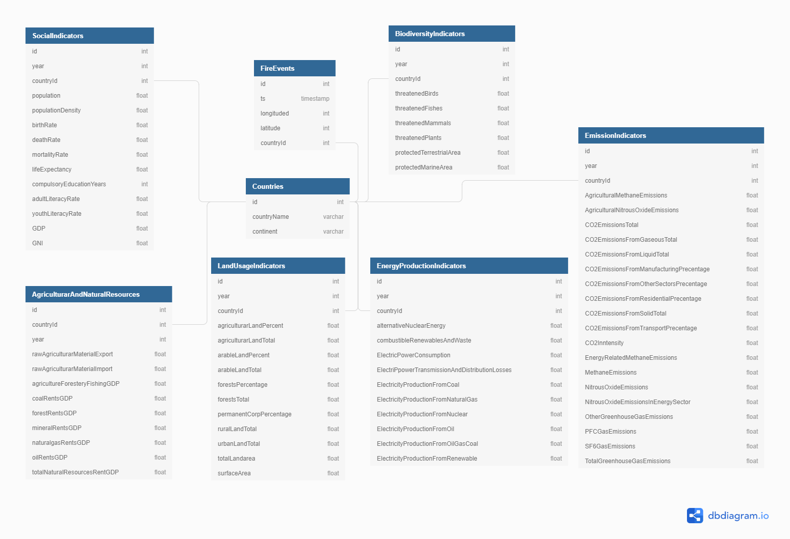

# Project description

In the last few months Amazon forest fires attracted the atention of the online media. The Amazon rainforest is an important part of Earth's ecosystem, it produces the 20 procent of the oxygen in the atmosphere, it slows doen the global warming. The fires in Amazon mainly caused by human activity. Therefore, I have built a Data Lake on S3, using satelite data published by NASA and World Bank data about several social and economic metrics of countries. The Data Lake can be used to look for economic or social origins of wildfires.

[Amazon rainforest fire: How did the Amazon fire start? How long has it been on fire?](https://www.express.co.uk/news/world/1168299/amazon-rainforest-fire-how-did-amazon-fires-start-cause-deforestation-how-long-fire)
[The Amazon in Brazil is on fire - how bad is it?](https://www.bbc.com/news/world-latin-america-49433767)

# Data sources

- [NASA Active Fire Data](https://earthdata.nasa.gov/earth-observation-data/near-real-time/firms/active-fire-data): NASA distributes Near Real-Time (NRT) active fire data within 3 hours of satellite overpass from NASA's Moderate Resolution Imaging Spectroradiometer (MODIS) and NASA's Visible Infrared Imaging Radiometer Suite (VIIRS). In this project I used the MODIS data source.

- [World Bank Open Data](https://data.worldbank.org/): World Bank provide data about economy, society and development indicators of countries. I downloaded this data in csv format, uploaded to S3 and processed with EMR cluster. 7 table were extracted from the raw data. 

# Data lake desing

The picture below depicts the schema of the data lake

# AWS infrastructure

- The AWS infrastructure is set up according to this [tutorial](https://www.themarketingtechnologist.co/upload-your-local-spark-script-to-an-aws-emr-cluster-using-a-simply-python-script/?fbclid=IwAR2fvjMwc4_z_AOmtyfOPma1LB4x4FSB6XhTeMn7LVUou--bMM1GvYmvymE).
- My python code (*run.py*) first creates an EMR cluster, uploads *setup.sh* file which installs the required python modules when the cluster is bootstraping and set the default python version to python 3. Then run the pyspark job, and terminates the cluster, when the job is done or failed.
- The pyspark job can be find in the *etl.py* script. It reads the raw data from S3 and writes it back after the transformation.

# Project extension for different scenarios

- 