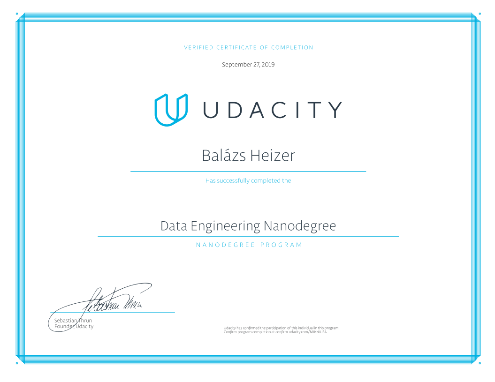

# Data Engineering Nanodegree Project Portfolio
In this nanodegree program I have learnt data modeling (relational and non-relational), building data warhouses, data lakes on cloud and automate data pipelines. The table below presents the projects I have completed during the Data Engeneering Nanodigree in 2019.

| Chapter                              | Project                                                                   | Progress    |
| ------------------------------------ | ------------------------------------------------------------------------- | ------------|
| Part 2 - Data Modeling               | [Data Modeling with Postgres](./Project1_Data_Modelling_With_Postgresql)  |                                       |
| Part 2 - Data Modeling               | [Data Modeling with Apache Cassandra](./Project2_Data_Modelling_With_Cassandra)  |                                        |
| Part 3 - Cloud Data Warehouses       | [Data Warehouse](./Project3_Cloud_Data_Warehouses_On_AWS)  |        |
| Part 4 - Data Lakes with Spark       | [Data Lake](./Project4_Data_Lakes_On_AWS)                  |             |
| Part 5 - Data Pipelines with Airflow | [Data Pipelines](./Project5_Data_Pipelines_With_Airflow)   |             |
| Part 6 - Capstone Project            | [Amazon Rainforest Fire](./Project6_Capstone_project_Forest_Fire_Observation)                                                                       |             |

## Certificate

